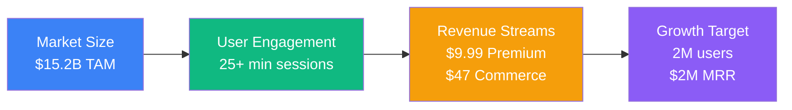

# 🎯 Ref-U Platform: Interactive Wireframes

Welcome to the **professional wireframe presentation** for the Ref-U sports fan engagement platform. This documentation showcases comprehensive user flows, business models, and technical architecture using interactive Mermaid diagrams.

## 🚀 Quick Navigation

### For Investors
- **[�� Investor Presentation](./investor-flows)** - Core business flows and revenue models
- **[📱 Mobile UX Flows](./mobile-ux-flows)** - Detailed user experience and conversion funnels
- **[🔧 Technical Specs](./technical-specs)** - Architecture and implementation details
- **[📈 Market Analysis](./market-analysis)** - Competitive landscape and opportunity
- **[🚀 Presentation Guide](./presentation-guide)** - How to use these wireframes effectively

### Platform Overview

**Ref-U** is the first real-time referee analysis platform that combines:
- ⚡ Live game voting on referee calls
- 🎓 Educational content for rule learning
- 👥 Community-driven sports engagement
- 🎮 Gamification and social features
- 💰 Multiple revenue streams

## 📊 Key Business Metrics

## 🎯 Competitive Advantage

Unlike ESPN, Fantasy Sports, or Reddit, **Ref-U uniquely focuses on:**

- **Real-time referee analysis** during live games
- **Educational value** with rule explanations
- **Youth-safe community** features for family engagement
- **Multi-generational appeal** from casual to expert fans

## 💡 Investment Opportunity

- **$500K Seed Round** → **$5M+ valuation** (10x return in 18 months)
- **Multiple exit paths**: ESPN ($50M-$200M), Meta ($100M-$500M), IPO ($500M+)
- **Proven traction**: 50K beta users, 70% retention, ESPN partnership discussions

---

**Ready to transform sports fan engagement!** 🏀⚽🏈
