# 🏀 Ref-U Platform: Complete Wireframes Package

Professional wireframe documentation for Ref-U, the revolutionary sports fan engagement platform transforming how fans interact with live sports through real-time referee analysis.

## 🎯 Platform Overview

**Ref-U** is the first real-time referee analysis platform combining:
- ⚡ **Live voting** on referee calls during games
- 🎓 **Educational content** for rule understanding  
- 👥 **Community building** through team cohorts
- 🎮 **Gamification** with XP and achievement systems
- 💰 **Multiple revenue streams** for sustainable growth

## 📊 Key Business Highlights

```mermaid
graph LR
    A[👥 50K Beta Users<br/>70% Retention] --> B[💰 Revenue Streams<br/>$9.99 Premium<br/>$47 Commerce]
    B --> C[📈 Growth Target<br/>2M Users<br/>$2M MRR]
    C --> D[🚀 Exit Potential<br/>$50M-$500M<br/>Multiple Acquirers]
    
    style A fill:#3b82f6,color:white
    style B fill:#10b981,color:white
    style C fill:#f59e0b,color:white
    style D fill:#8b5cf6,color:white
```

## 💡 Investment Opportunity Summary

- **Market Size**: $15.2B TAM in sports technology
- **Traction**: 50K engaged users, 70% retention rate  
- **Revenue Model**: Multiple streams with 15.2% premium conversion
- **Exit Strategy**: Clear path to $50M-$500M acquisition
- **Competitive Advantage**: First-mover in referee analysis space

**Ready for Series A funding to scale to 2M users and $2M MRR** 🚀

---

*Use the navigation menu to explore detailed wireframes, business models, and technical specifications.*
