# 🏀 Ref-U Platform: Complete Wireframes Package

Welcome to the **comprehensive wireframe documentation** for Ref-U, the revolutionary sports fan engagement platform that's transforming how fans interact with live sports through real-time referee analysis.

## 🎯 Quick Start for Different Audiences

<h3>👥 For Investors</h3>

<strong>Focus on business potential and ROI</strong>

<ul>
<li><a href="/visual-wireframes">📱 Visual Wireframes & Mockups</a></li>
<li><a href="/investor-flows">📊 Business Model & Revenue Flows</a></li>
<li><a href="/market-analysis">📈 Market Analysis & Competition</a></li>
</ul>

<em>Perfect for: Pitch decks, due diligence, partnership discussions</em>

<h3>🔧 For Developers</h3>

<strong>Technical implementation details</strong>

<ul>
<li><a href="/technical-specs">⚙️ Technical Architecture</a></li>
<li><a href="/mobile-ux-flows">📱 Detailed UX Flows</a></li>
<li><a href="/presentation-guide">📋 Implementation Guide</a></li>
</ul>

<em>Perfect for: Development planning, technical analysis, system design</em>

## 🚀 Platform Overview

**Ref-U** is the first real-time referee analysis platform combining:
- ⚡ **Live voting** on referee calls during games
- 🎓 **Educational content** for rule understanding
- 👥 **Community building** through team cohorts
- 🎮 **Gamification** with XP and achievement systems
- 💰 **Multiple revenue streams** for sustainable growth

## 📊 Key Business Highlights

```mermaid
graph LR
    A[👥 50K Beta Users<br/>70% Retention] --> B[💰 Revenue Streams<br/>$9.99 Premium<br/>$47 Commerce]
    B --> C[📈 Growth Target<br/>2M Users<br/>$2M MRR]
    C --> D[🚀 Exit Potential<br/>$50M-$500M<br/>Multiple Acquirers]
    
    style A fill:#3b82f6,color:white
    style B fill:#10b981,color:white
    style C fill:#f59e0b,color:white
    style D fill:#8b5cf6,color:white
```

## 🎯 Why Ref-U Wins

<h4>🎯 Unique Focus</h4>

Only platform dedicated to referee analysis - no direct competition

<h4>📚 Educational Value</h4>

Fans learn rules while engaging, creating long-term retention

<h4>👨‍👩‍👧‍👦 Family Safe</h4>

Youth-focused features make it suitable for all ages

## 📱 User Experience Preview

Our wireframes showcase a seamless experience across all touchpoints:

### Live Game Experience
- **Real-time voting** on controversial calls
- **Community discussions** with fellow fans  
- **Educational content** explaining complex rules
- **Gamification** with points, streaks, and achievements

### Revenue Generation
- **Premium subscriptions** ($9.99/month) for advanced analytics
- **Social commerce** integration with team merchandise
- **B2B partnerships** with sports organizations
- **Advertising** opportunities with contextual relevance

## 🎨 Complete Wireframe Collection

This documentation includes:

1. **[📱 Visual Wireframes](/visual-wireframes)** - Comprehensive mockups with ASCII art and detailed user flows
2. **[📊 Interactive Business Flows](/investor-flows)** - Mermaid diagrams showing revenue and growth models  
3. **[📱 Mobile UX Details](/mobile-ux-flows)** - Step-by-step user journey and conversion funnels
4. **[⚙️ Technical Architecture](/technical-specs)** - Implementation details and scalability plans
5. **[📈 Market Analysis](/market-analysis)** - Competitive landscape and opportunity sizing
6. **[📋 Presentation Guide](/presentation-guide)** - How to use these wireframes effectively

---

## 💡 Investment Opportunity Summary

- **Market Size**: $15.2B TAM in sports technology
- **Traction**: 50K engaged users, 70% retention rate
- **Revenue Model**: Multiple streams with 15.2% premium conversion
- **Exit Strategy**: Clear path to $50M-$500M acquisition
- **Competitive Advantage**: First-mover in referee analysis space

**Ready for Series A funding to scale to 2M users and $2M MRR** 🚀

**Navigate using the sidebar to explore detailed wireframes for your specific needs!**
