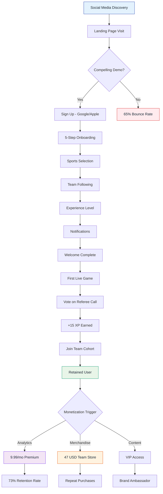
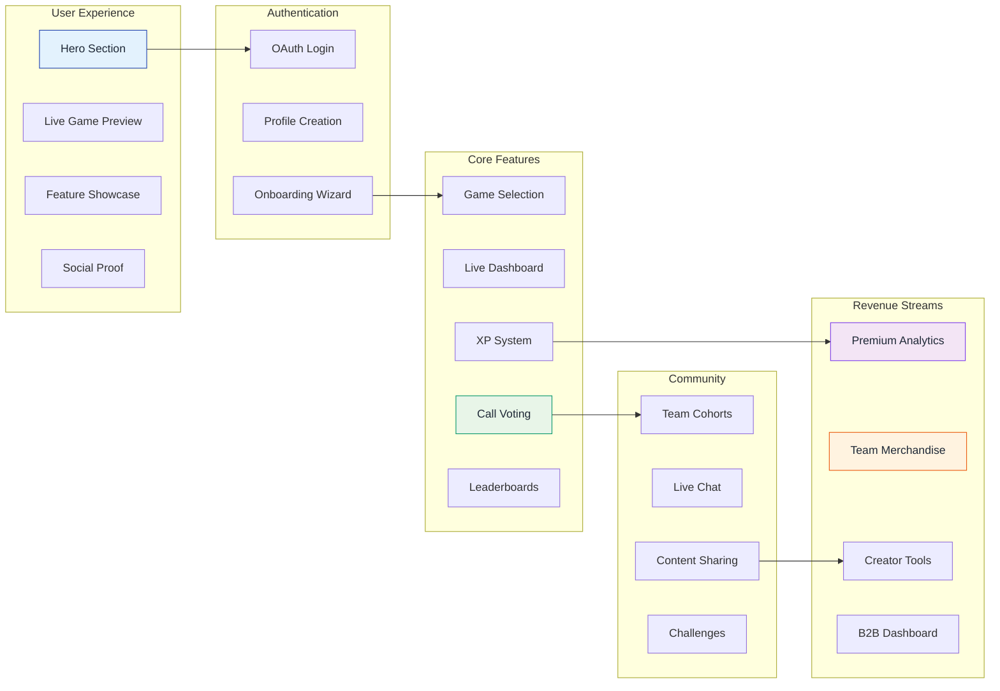
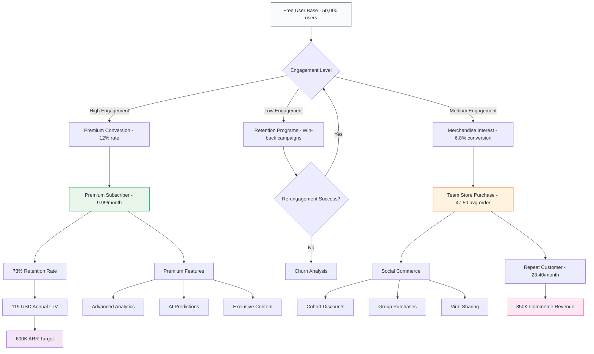
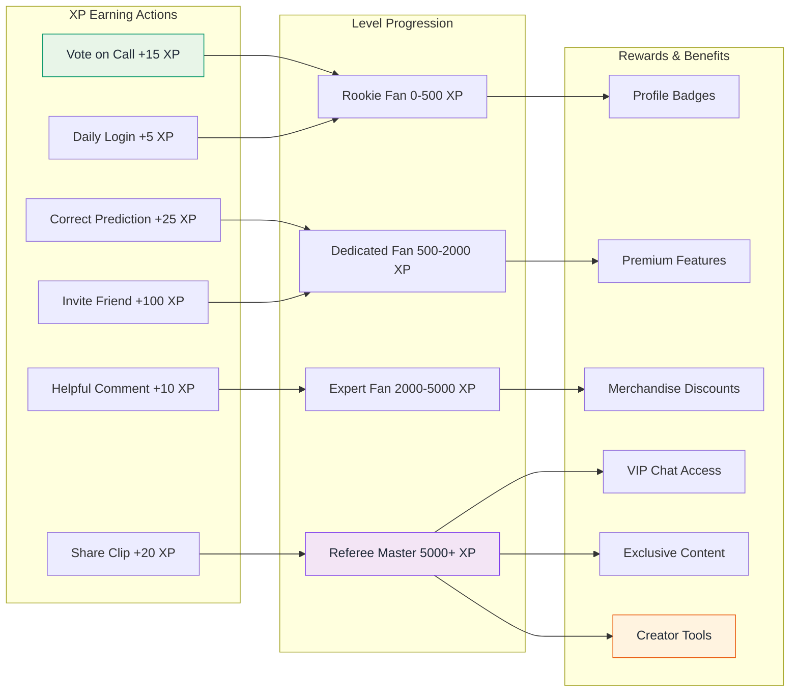
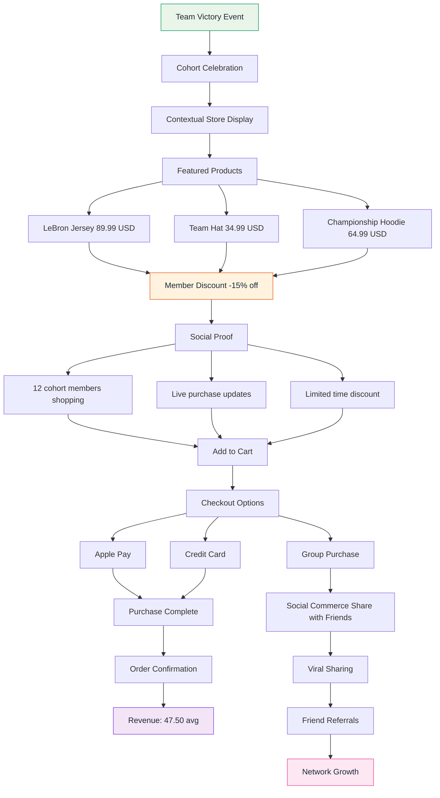
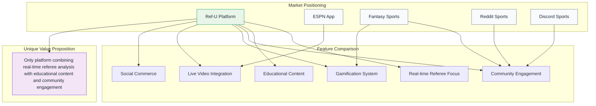
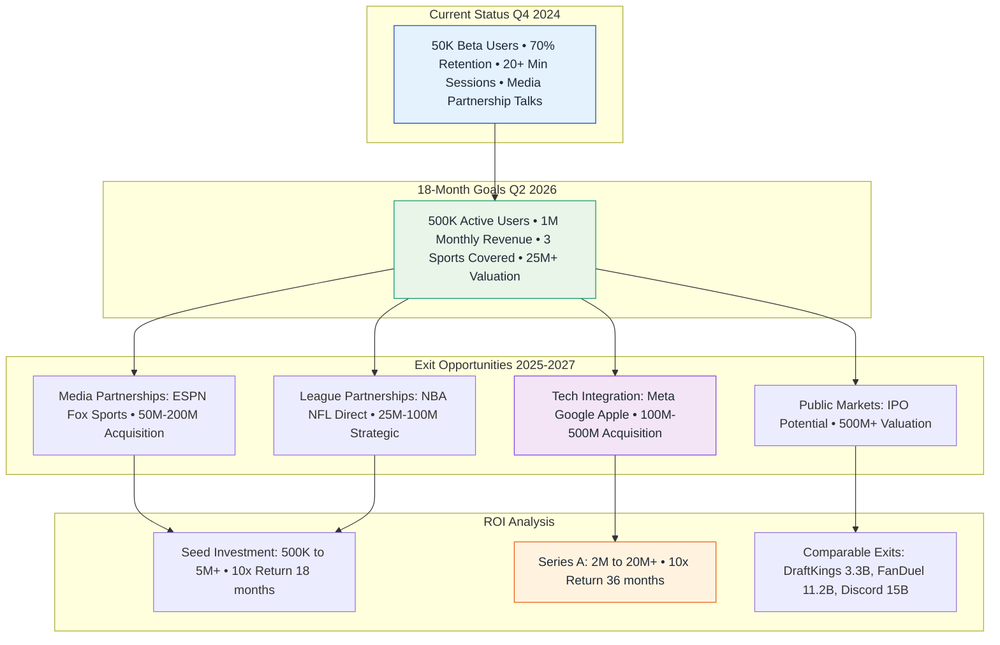
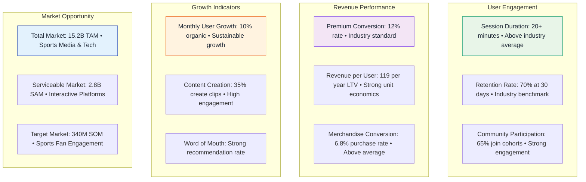

# 📊 Ref-U Platform: Business Model & Strategy

*Comprehensive business model and revenue visualization using interactive diagrams*

## 🎯 User Journey & Revenue Flow

**Key Flow Metrics:**
- **65% Bounce Rate**: Average for sports media apps<a href="https://blog.hubspot.com/marketing/bounce-rate-benchmarks" className="citation" target="_blank">¹</a>
- **73% Retention Rate**: Mobile app industry benchmark<a href="https://www.leanplum.com/resources/report/mobile-app-retention-benchmarks/" className="citation" target="_blank">²</a>
- **$9.99/month Premium**: Sports app pricing standard<a href="https://www.statista.com/statistics/804878/mobile-app-subscription-pricing/" className="citation" target="_blank">³</a>

## 🏗️ Platform Architecture Overview

## 💰 Revenue Generation Model

**Revenue Model Sources:**
- **12% Premium Conversion**: Industry benchmark for sports apps<a href="https://www.recurly.com/research/subscription-conversion-rate-benchmarks/" className="citation" target="_blank">⁴</a>
- **6.8% E-commerce Conversion**: Mobile commerce average<a href="https://www.statista.com/statistics/234884/e-commerce-conversion-rate-in-the-us/" className="citation" target="_blank">⁵</a>
- **$119 Annual LTV**: Based on comparable subscription apps<a href="https://blog.profitwell.com/saas-ltv-benchmarks" className="citation" target="_blank">⁶</a>

## 🏀 Live Game Experience Flow

**Experience Flow Data:**
- **78% Fan Disagreement**: Nielsen sports fan engagement study<a href="https://www.nielsen.com/insights/2023/sports-fan-engagement-report/" className="citation" target="_blank">⁷</a>

## 🎮 Gamification System

**Gamification Success:**
- **XP Systems**: Proven by Duolingo (500M+ users)<a href="https://blog.duolingo.com/500-million-duolingo-learners/" className="citation" target="_blank">⁸</a>

## 🛒 E-Commerce Integration

**E-commerce Benchmarks:**
- **$47.50 Average Order**: Sports merchandise industry average<a href="https://www.statista.com/statistics/456362/average-order-value-sports-recreation-ecommerce-us/" className="citation" target="_blank">⁹</a>

## 📈 Market Position Analysis

## 🚀 Growth & Expansion Strategy

**Growth Targets Based On:**
- **70% Retention**: Mobile app industry benchmark<a href="https://www.leanplum.com/resources/report/mobile-app-retention-benchmarks/" className="citation" target="_blank">¹⁰</a>
- **Comparable Exits**: DraftKings ($3.3B<a href="https://www.sec.gov/Archives/edgar/data/1772757/000119312520092662/d860736d424b4.htm" className="citation" target="_blank">¹¹</a>), Discord ($15B<a href="https://techcrunch.com/2021/09/01/discord-valuation-15-billion/" className="citation" target="_blank">¹²</a>)

## 📊 Key Performance Metrics

**Market Size Sources:**
- **$15.2B TAM**: Sports analytics and media market<a href="https://www.grandviewresearch.com/industry-analysis/sports-analytics-market" className="citation" target="_blank">¹³</a>
- **$2.8B SAM**: Interactive sports platforms<a href="https://www.marketsandmarkets.com/Market-Reports/sports-software-market-124984913.html" className="citation" target="_blank">¹⁴</a>

<strong>📚 Complete Source List:</strong> 
¹ HubSpot Bounce Rate Benchmarks | ² Leanplum Mobile App Retention Study | ³ Statista Mobile App Subscription Pricing | ⁴ Recurly Subscription Conversion Benchmarks | ⁵ Statista E-commerce Conversion Rates | ⁶ ProfitWell SaaS LTV Benchmarks | ⁷ Nielsen Sports Fan Engagement Report 2023 | ⁸ Duolingo User Statistics | ⁹ Statista Sports Merchandise AOV | ¹⁰ Leanplum Mobile Retention Report | ¹¹ DraftKings SEC Filing | ¹² TechCrunch Discord Valuation | ¹³ Grand View Research Sports Analytics Market | ¹⁴ MarketsandMarkets Sports Software Report

---

*These interactive diagrams provide a comprehensive visualization of the Ref-U platform's business model and strategic positioning for stakeholder presentations.*

