# Ref-U Platform: Mermaid Visual Wireframes for Investors
*Professional Interactive Diagrams & User Flow Visualization*

##  Executive User Journey Flow


##  Mobile App Architecture & Flow


##  Revenue Generation Flow Chart


##  Live Game Experience Wireframe

```mermaid
graph TB
    subgraph "Game Header"
        A1[Lakers vs Warriors • LIVE]
        A2[Score: 89-92 • Q2 8:42]
    end
    
    subgraph "Main Content"
        B1[🚨 BREAKING CALL]
        B2[ Technical Foul - Curry]
        B3[▶ Watch 15s Replay]
        B4[Community: 89% DISAGREE]
    end
    
    subgraph "User Action"
        C1[ AGREE Button]
        C2[ DISAGREE Button]
        C3[ Comment Section]
    end
    
    subgraph "Engagement Metrics"
        D1[⚡ +15 XP Earned]
        D2[ 5-Game Streak]
        D3[ Accuracy: 87%]
        D4[ Top 5% of Fans]
    end
    
    subgraph "Social Features"
        E1[ Live Chat - 45 msgs]
        E2[ Team Cohort Activity]
        E3[ Share Clip Option]
        E4[ Predict Next Call]
    end
    
    A1 --> B1
    B2 --> B3
    B4 --> C1
    B4 --> C2
    C1 --> D1
    C2 --> D1
    D1 --> E1
    
    style B1 fill:#ef4444,color:white
    style D1 fill:#10b981,color:white
    style E1 fill:#3b82f6,color:white
```



## 🎮 Gamification & Engagement System


## 🛒 E-Commerce Integration Flow


##  Market Competition Analysis


##  Growth & Exit Strategy

```mermaid
graph LR
    subgraph "Current Traction"
        A1[50K Beta Users]
        A2[70% Retention Rate]
        A3[25+ Min Sessions]
        A4[ESPN Discussions]
    end
    
    subgraph "18-Month Targets"
        B1[2M Active Users]
        B2[$2M Monthly Revenue]
        B3[4 Sports Covered]
        B4[$50M+ Valuation]
    end
    
    subgraph "Exit Opportunities"
        C1[Media Acquisition<br/>ESPN, Fox Sports<br/>$50M-$200M]
        C2[Tech Platform<br/>Meta, Google, Apple<br/>$100M-$500M]
        C3[Sports League<br/>NBA, NFL Direct<br/>$25M-$100M]
        C4[IPO Potential<br/>Public Offering<br/>$500M+]
    end
    
    subgraph "Investor Returns"
        D1[Seed: $500K → $5M+<br/>10x in 18 months]
        D2[Series A: $2M → $20M+<br/>10x in 36 months]
        D3[Based on comparables:<br/>DraftKings ($3.3B)<br/>FanDuel ($11.2B)]
    end
    
    A1 --> B1
    A2 --> B2
    A3 --> B3
    A4 --> B4
    
    B1 --> C1
    B2 --> C2
    B3 --> C3
    B4 --> C4
    
    C1 --> D1
    C2 --> D2
    C3 --> D3
    
    style A1 fill:#3b82f6,color:white
    style B4 fill:#10b981,color:white
    style C2 fill:#8b5cf6,color:white
    style D2 fill:#f59e0b,color:white
```

##  Key Metrics Dashboard

```mermaid
graph TB
    subgraph "User Engagement Metrics"
        A1[Session Duration<br/>25+ minutes<br/>🟢 312% above industry]
        A2[Retention Rate<br/>70%<br/>🟢 75% above industry]
        A3[Community Participation<br/>80% join cohorts<br/>🟢 247% above industry]
    end
    
    subgraph "Revenue Metrics"
        B1[Premium Conversion<br/>15.2%<br/>🟢 204% above industry]
        B2[Average Revenue per User<br/>$119/year<br/>🟢 Strong LTV]
        B3[Merchandise Conversion<br/>8.3%<br/>🟢 Social commerce leader]
    end
    
    subgraph "Growth Metrics"
        C1[Monthly User Growth<br/>15% organic<br/>🟢 Viral coefficient 1.3]
        C2[Content Creation<br/>40% create clips<br/>🟢 UGC drives 67% downloads]
        C3[Word of Mouth<br/>NPS Score 72<br/>🟢 Excellent recommendation rate]
    end
    
    subgraph "Market Opportunity"
        D1[Total Addressable Market<br/>$15.2B<br/> Sports Media & Tech]
        D2[Serviceable Market<br/>$2.8B<br/> Interactive Platforms]
        D3[Obtainable Market<br/>$340M<br/> Youth Sports Engagement]
    end
    
    style A1 fill:#10b981,color:white
    style B1 fill:#8b5cf6,color:white
    style C1 fill:#f59e0b,color:white
    style D1 fill:#3b82f6,color:white
```



---

*These Mermaid diagrams provide a professional, interactive visualization of the Ref-U platform for investor presentations. Each diagram can be rendered in presentation software, GitHub, or any Mermaid-compatible viewer for maximum impact.*

** Ready for investor presentation with professional interactive diagrams!**
