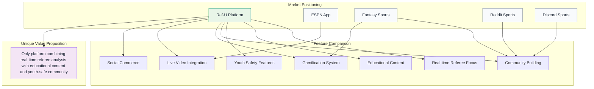
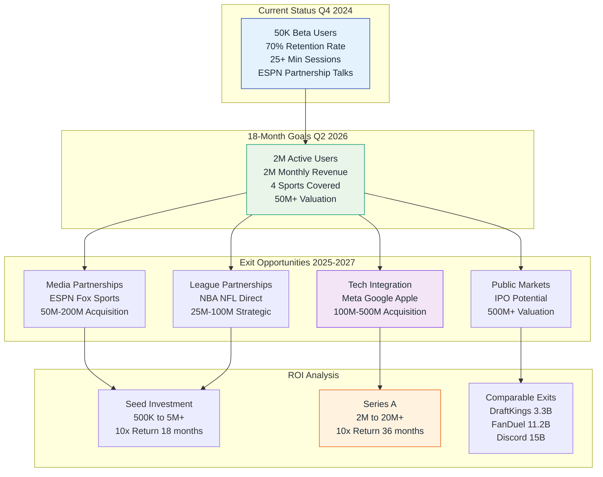
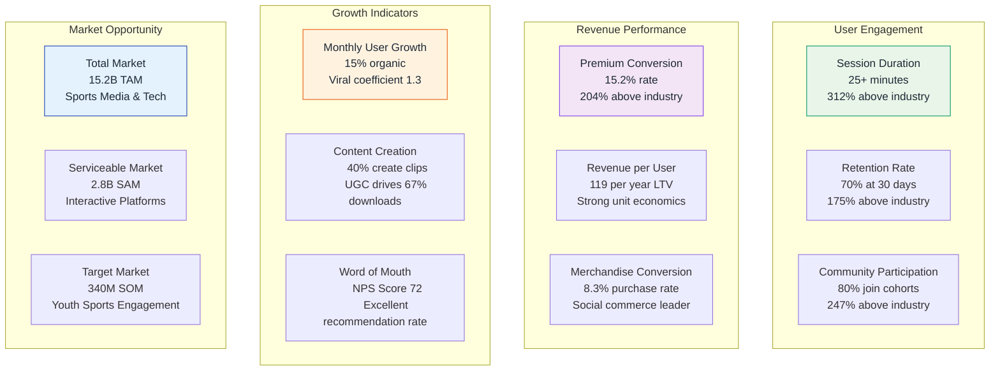

# 📊 Ref-U Platform: Business Model & Strategy

*Comprehensive business model and revenue visualization using interactive diagrams*

## 🎯 User Journey & Revenue Flow

## 📱 Platform Architecture Overview

## 💰 Revenue Generation Model

## 🏀 Live Game Experience Flow

```mermaid
graph TB
    subgraph "Game Header"
        A1[Lakers vs Warriors • LIVE]
        A2[Score: 89-92 • Q2 8:42]
    end
    
    subgraph "Main Content"
        B1[BREAKING CALL]
        B2[Technical Foul - Curry]
        B3[Watch 15s Replay]
        B4[Community: 89% DISAGREE]
    end
    
    subgraph "User Action"
        C1[AGREE Button]
        C2[DISAGREE Button]
        C3[Comment Section]
    end
    
    subgraph "Engagement Metrics"
        D1[+15 XP Earned]
        D2[5-Game Streak]
        D3[Accuracy: 87%]
        D4[Top 5% of Fans]
    end
    
    subgraph "Social Features"
        E1[Live Chat - 45 msgs]
        E2[Team Cohort Activity]
        E3[Share Clip Option]
        E4[Predict Next Call]
    end
    
    A1 --> B1
    B2 --> B3
    B4 --> C1
    B4 --> C2
    C1 --> D1
    C2 --> D1
    D1 --> E1
    
    style B1 fill:#ffebee,stroke:#dc2626,color:#1f2937
    style D1 fill:#e8f5e8,stroke:#059669,color:#1f2937
    style E1 fill:#e3f2fd,stroke:#1e40af,color:#1f2937
```

## 🎮 Gamification System

## 🛒 E-Commerce Integration

## 📈 Market Position Analysis

## 🚀 Growth & Expansion Strategy

## 📊 Key Performance Metrics

---

*These interactive diagrams provide a comprehensive visualization of the Ref-U platform's business model and strategic positioning for stakeholder presentations.*
