# 📊 Ref-U Platform: Business Model & Strategy

*Comprehensive business model and revenue visualization using interactive diagrams*

<strong>📍 Current Stage:</strong> Pre-Beta Development - All user metrics and revenue figures represent projections based on industry benchmarks and market research. Currently building MVP for Q4 2025 beta launch.

## 🎯 User Journey & Revenue Flow

```mermaid
graph TD
    A[Social Media Discovery] --> B[Landing Page Visit]
    B --> C{Compelling Demo?}
    C -->|Yes| D[Sign Up - Google/Apple]
    C -->|No| X[65% Bounce Rate¹]
    
    D --> E[5-Step Onboarding]
    E --> F[Sports Selection]
    F --> G[Team Following]
    G --> H[Experience Level]
    H --> I[Notifications]
    I --> J[Welcome Complete]
    
    J --> K[First Live Game]
    K --> L[Vote on Referee Call]
    L --> M[+15 XP Earned]
    M --> N[Join Team Cohort]
    N --> O[Retained User]
    
    O --> P{Monetization Trigger}
    P -->|Analytics| Q[9.99/mo Premium³]
    P -->|Merchandise| R[47 USD Team Store⁹]
    P -->|Content| S[VIP Access]
    
    Q --> T[73% Retention Rate²]
    R --> U[Repeat Purchases]
    S --> V[Brand Ambassador]
    
    style A fill:#e3f2fd,stroke:#1e40af,color:#1f2937
    style O fill:#e8f5e8,stroke:#059669,color:#1f2937
    style Q fill:#f3e5f5,stroke:#7c3aed,color:#1f2937
    style R fill:#fff3e0,stroke:#ea580c,color:#1f2937
    style X fill:#ffebee,stroke:#dc2626,color:#1f2937
```

## 💰 Revenue Generation Model (Projections)

## 🏀 Live Game Experience Flow

## 🎮 Gamification System

Gamification proven successful by Duolingo (500M+ users)⁸.

## 📈 Market Position Analysis

## 🚀 Growth & Expansion Strategy

```mermaid
graph TB
    subgraph "Current Status Q4 2024"
        A1[Pre-Beta Development • MVP 85% Complete • Team Assembled • Seeking Funding]
    end
    
    subgraph "12-Month Goals Q4 2025"
        B1[Beta Launch Q4 2025 • $250K ARR • Product-Market Fit Testing]
    end
    
    subgraph "24-Month Goals 2026"
        C1[Monthly Breakeven Month 18 • Total Breakeven Month 24 • $3.2M ARR • Series A Ready]
    end
    
    subgraph "Exit Opportunities 2026-2028"
        D1[Media Partnerships: ESPN Fox Sports • 50M-200M Acquisition]
        D2[Tech Integration: Meta Google Apple • 100M-500M Acquisition]
        D3[League Partnerships: NBA NFL Direct • 25M-100M Strategic]
        D4[Public Markets: IPO Potential • 500M+ Valuation]
    end
    
    A1 --> B1
    B1 --> C1
    C1 --> D1
    C1 --> D2
    C1 --> D3
    C1 --> D4
    
    style A1 fill:#e3f2fd,stroke:#1e40af,color:#1f2937
    style B1 fill:#e8f5e8,stroke:#059669,color:#1f2937
    style C1 fill:#f3e5f5,stroke:#7c3aed,color:#1f2937
    style D2 fill:#fff3e0,stroke:#ea580c,color:#1f2937
```

Comparable exits: DraftKings ($3.3B)¹⁰, Discord ($15B)¹¹.

## 📊 Market Opportunity

```mermaid
graph TB
    subgraph "Market Sizes"
        D1[Total Market: $15.2B TAM¹²<br/>Sports Media & Tech]
        D2[Serviceable Market: $2.8B SAM¹³<br/>Interactive Platforms]
        D3[Target Market: $340M SOM<br/>Sports Fan Engagement]
    end
    
    subgraph "Target Projections"
        A1[Year 1: Pre-Beta MVP]
        A2[Year 2: 25K Active Users]
        A3[Year 3: 100K Active Users]
    end
    
    subgraph "Revenue Targets"
        B1[Year 1: $250K ARR]
        B2[Year 2: $3.2M ARR]
        B3[Year 3: $10M ARR]
    end
    
    D1 --> D2 --> D3
    A1 --> A2 --> A3
    B1 --> B2 --> B3
    
    style D1 fill:#e3f2fd,stroke:#1e40af,color:#1f2937
    style A3 fill:#e8f5e8,stroke:#059669,color:#1f2937
    style B3 fill:#f3e5f5,stroke:#7c3aed,color:#1f2937
```

---

## 📚 Sources

**Industry Benchmarks & Market Data:**

1. [HubSpot Bounce Rate Benchmarks](https://blog.hubspot.com/marketing/bounce-rate-benchmarks) - Sports media apps average 65% bounce rate
2. [Leanplum Mobile App Retention Study](https://www.leanplum.com/resources/report/mobile-app-retention-benchmarks/) - 73% retention at 30 days industry benchmark
3. [Statista Mobile App Subscription Pricing](https://www.statista.com/statistics/804878/mobile-app-subscription-pricing/) - $9.99/month sports app standard
4. [Recurly Subscription Conversion Benchmarks](https://www.recurly.com/research/subscription-conversion-rate-benchmarks/) - 12% premium conversion rate
5. [Statista E-commerce Conversion Rates](https://www.statista.com/statistics/234884/e-commerce-conversion-rate-in-the-us/) - 6.8% mobile commerce average
6. [ProfitWell SaaS LTV Benchmarks](https://blog.profitwell.com/saas-ltv-benchmarks) - $119 annual LTV comparable apps
7. [Nielsen Sports Fan Engagement Report 2023](https://www.nielsen.com/insights/2023/sports-fan-engagement-report/) - 78% fan disagreement with referee calls
8. [Duolingo User Statistics](https://blog.duolingo.com/500-million-duolingo-learners/) - 500M+ users prove gamification success
9. [Statista Sports Merchandise AOV](https://www.statista.com/statistics/456362/average-order-value-sports-recreation-ecommerce-us/) - $47.50 average order value
10. [DraftKings SEC Filing](https://www.sec.gov/Archives/edgar/data/1772757/000119312520092662/d860736d424b4.htm) - $3.3B valuation
11. [TechCrunch Discord Valuation](https://techcrunch.com/2021/09/01/discord-valuation-15-billion/) - $15B acquisition value
12. [Grand View Research Sports Analytics Market](https://www.grandviewresearch.com/industry-analysis/sports-analytics-market) - $15.2B TAM
13. [MarketsandMarkets Sports Software Report](https://www.marketsandmarkets.com/Market-Reports/sports-software-market-124984913.html) - $2.8B SAM

---

*All projections based on industry benchmarks and market research. Company is currently in pre-beta development stage.*

