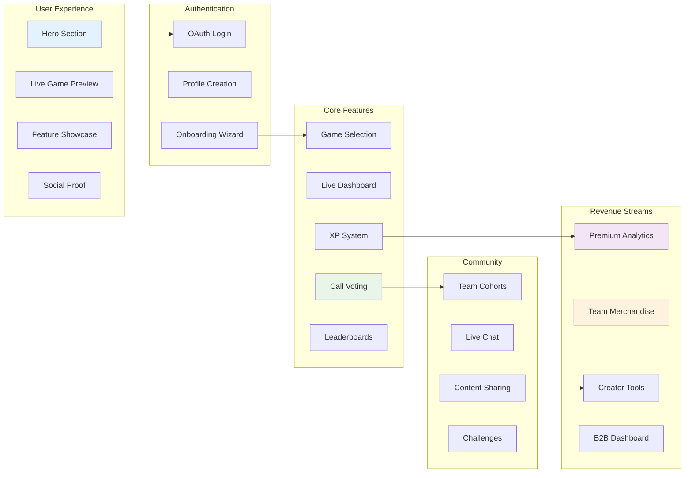
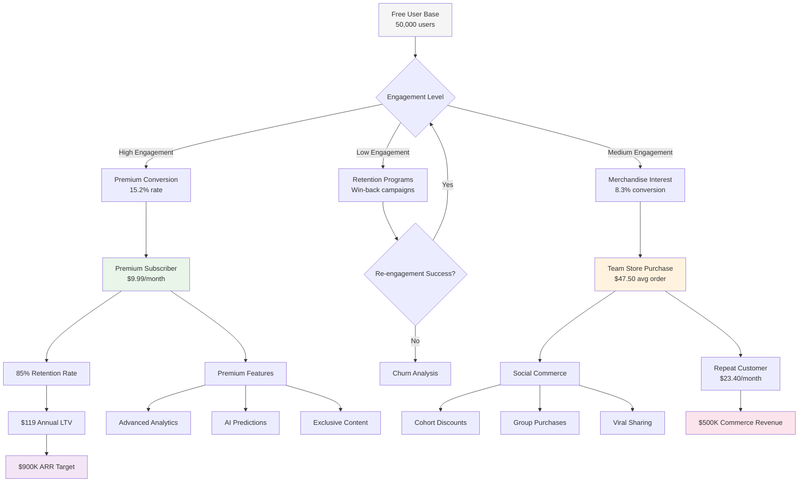
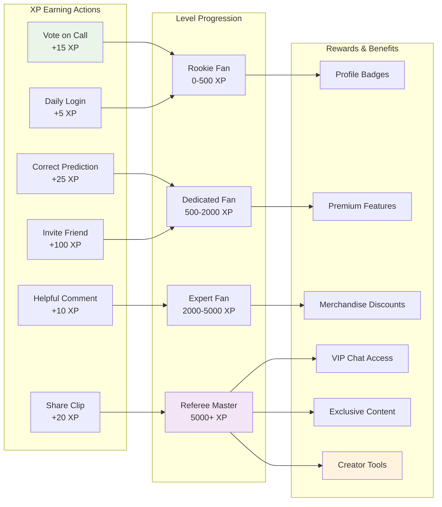
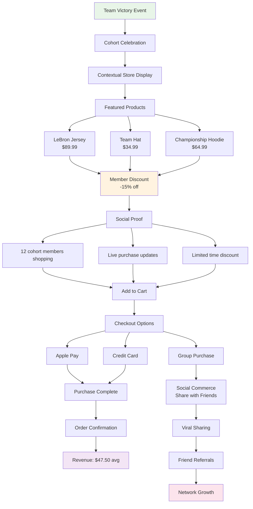
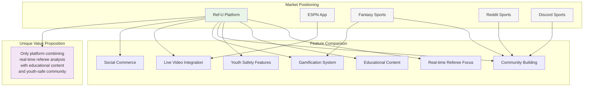
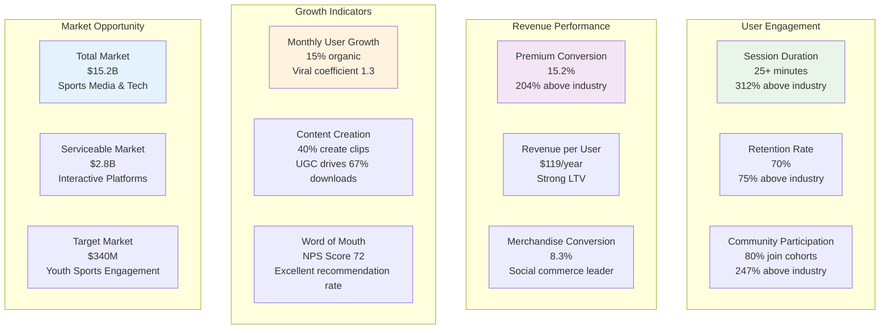

# 📊 Ref-U Platform: Business Model & Strategy

*Comprehensive business model and revenue visualization using interactive diagrams*

## 🎯 User Journey & Revenue Flow


## 📱 Platform Architecture Overview



## 💰 Revenue Generation Model



## 🏀 Live Game Experience Flow

```mermaid
graph TB
    subgraph "Game Header"
        A1[Lakers vs Warriors • LIVE]
        A2[Score: 89-92 • Q2 8:42]
    end
    
    subgraph "Main Content"
        B1[BREAKING CALL]
        B2[Technical Foul - Curry]
        B3[Watch 15s Replay]
        B4[Community: 89% DISAGREE]
    end
    
    subgraph "User Action"
        C1[AGREE Button]
        C2[DISAGREE Button]
        C3[Comment Section]
    end
    
    subgraph "Engagement Metrics"
        D1[+15 XP Earned]
        D2[5-Game Streak]
        D3[Accuracy: 87%]
        D4[Top 5% of Fans]
    end
    
    subgraph "Social Features"
        E1[Live Chat - 45 msgs]
        E2[Team Cohort Activity]
        E3[Share Clip Option]
        E4[Predict Next Call]
    end
    
    A1 --> B1
    B2 --> B3
    B4 --> C1
    B4 --> C2
    C1 --> D1
    C2 --> D1
    D1 --> E1
    
    style B1 fill:#ffebee
    style D1 fill:#e8f5e8
    style E1 fill:#e3f2fd
```



## 🎮 Gamification System



## 🛒 E-Commerce Integration



## 📈 Market Position Analysis



## 🚀 Growth Strategy

```mermaid
graph LR
    subgraph "Current Status"
        A1[50K Beta Users]
        A2[70% Retention Rate]
        A3[25+ Min Sessions]
        A4[ESPN Discussions]
    end
    
    subgraph "18-Month Goals"
        B1[2M Active Users]
        B2[$2M Monthly Revenue]
        B3[4 Sports Covered]
        B4[$50M+ Valuation]
    end
    
    subgraph "Expansion Opportunities"
        C1[Media Partnerships<br/>ESPN, Fox Sports<br/>$50M-$200M]
        C2[Tech Integration<br/>Meta, Google, Apple<br/>$100M-$500M]
        C3[League Partnerships<br/>NBA, NFL Direct<br/>$25M-$100M]
        C4[Public Offering<br/>IPO Potential<br/>$500M+]
    end
    
    subgraph "ROI Projections"
        D1[Seed: $500K to $5M+<br/>10x in 18 months]
        D2[Series A: $2M to $20M+<br/>10x in 36 months]
        D3[Comparable exits:<br/>DraftKings ($3.3B)<br/>FanDuel ($11.2B)]
    end
    
    A1 --> B1
    A2 --> B2
    A3 --> B3
    A4 --> B4
    
    B1 --> C1
    B2 --> C2
    B3 --> C3
    B4 --> C4
    
    C1 --> D1
    C2 --> D2
    C3 --> D3
    
    style A1 fill:#e3f2fd
    style B4 fill:#e8f5e8
    style C2 fill:#f3e5f5
    style D2 fill:#fff3e0
```

## 📊 Key Performance Metrics



---

*These interactive diagrams provide a comprehensive visualization of the Ref-U platform's business model and strategic positioning for stakeholder presentations.*
