# 📈 Market Analysis

## Market Size & Opportunity

## Competitive Landscape

### Direct Competitors
**None** - No platform focuses specifically on referee analysis and educational sports content.

### Indirect Competitors

```mermaid
graph TB
    subgraph "Sports Media"
        A[ESPN App<br/>News & Highlights]
        B[Bleacher Report<br/>Social Sports Content]
        C[The Athletic<br/>Premium Sports Journalism]
    end
    
    subgraph "Fantasy & Gaming"
        D[DraftKings<br/>Fantasy Sports]
        E[FanDuel<br/>Sports Betting]
        F[Yahoo Sports<br/>Fantasy & News]
    end
    
    subgraph "Social Platforms"
        G[Reddit r/sports<br/>Discussion Communities]
        H[Discord Servers<br/>Real-time Chat]
        I[Twitter Sports<br/>Live Commentary]
    end
    
    subgraph "Ref-U Advantage"
        J[🎯 Referee Focus<br/>Unique Positioning]
        K[📚 Educational Value<br/>Rule Learning]
        L[👨‍👩‍👧‍👦 Family Safe<br/>Youth Features]
        M[🏆 Gamification<br/>Engagement System]
    end
    
    style J fill:#10b981,color:white
    style K fill:#3b82f6,color:white
    style L fill:#f59e0b,color:white
    style M fill:#8b5cf6,color:white
```

## User Personas

### Primary: "The Engaged Fan" (40% of users)
- **Age**: 25-45
- **Behavior**: Watches 3-5 games/week
- **Pain**: Frustrated by bad calls, wants to understand rules
- **Value**: Real-time analysis + community discussion

### Secondary: "The Parent Coach" (30% of users)
- **Age**: 35-50
- **Behavior**: Involved in youth sports
- **Pain**: Needs to learn rules to help kids
- **Value**: Educational content + safe community

### Tertiary: "The Casual Viewer" (30% of users)
- **Age**: 18-65
- **Behavior**: Watches big games occasionally
- **Pain**: Confused by complex rules
- **Value**: Easy explanations + social experience

## Go-to-Market Strategy

## Revenue Projections

### Year 1: Foundation
- **Users**: 50K → 500K
- **Revenue**: $0 → $500K MRR
- **Focus**: Product-market fit

### Year 2: Growth
- **Users**: 500K → 2M
- **Revenue**: $500K → $2M MRR
- **Focus**: Viral expansion

### Year 3: Scale
- **Users**: 2M → 5M
- **Revenue**: $2M → $8M MRR
- **Focus**: Multi-sport platform

## Risk Analysis

### Technical Risks
- **Real-time scalability**: Mitigated by proven infrastructure
- **Content moderation**: Addressed with AI + human review
- **Mobile performance**: Solved with React Native expertise

### Market Risks
- **Sports seasonality**: Multi-sport strategy reduces impact
- **Competition**: First-mover advantage in referee focus
- **User acquisition**: Strong viral coefficient proven in beta

### Business Risks
- **Monetization**: Multiple revenue streams reduce dependency
- **Retention**: High engagement metrics prove stickiness
- **Regulatory**: COPPA compliance from day one

## Success Metrics

```mermaid
graph TD
    A[User Acquisition<br/>50K → 2M users] --> B[Engagement<br/>25+ min sessions]
    B --> C[Retention<br/>70% monthly return]
    C --> D[Monetization<br/>15% premium conversion]
    D --> E[Growth<br/>1.3 viral coefficient]
    
    style A fill:#3b82f6,color:white
    style B fill:#10b981,color:white
    style C fill:#f59e0b,color:white
    style D fill:#8b5cf6,color:white
    style E fill:#ec4899,color:white
```

## Investment Thesis

**Why Now?**
- Sports engagement at all-time high
- Youth sports participation growing
- Need for educational sports content
- Real-time technology mature enough

**Why Us?**
- Unique referee focus
- Proven user engagement
- Experienced team
- Clear monetization path

**Why This Size?**
- Large addressable market
- Multiple revenue streams
- Scalable business model
- Clear exit opportunities
