# 📈 Market Analysis

## Total Addressable Market

## Competitive Landscape

```mermaid
graph TB
    subgraph "Traditional Sports Media"
        A[ESPN App News & Highlights]
        B[Bleacher Report Social Sports Content]
        C[The Athletic Premium Sports Journalism]
    end
    
    subgraph "Fantasy & Betting"
        D[DraftKings Fantasy Sports]
        E[FanDuel Sports Betting]
        F[Yahoo Sports Fantasy & News]
    end
    
    subgraph "Social & Community"
        G[Reddit r/sports Discussion Communities]
        H[Discord Servers Real-time Chat]
        I[Twitter Sports Live Commentary]
    end
    
    subgraph "Ref-U Unique Position"
        J[🏀 Referee Focus Unique Positioning]
        K[📚 Educational Value Rule Learning]
        L[👩👧👦 Family Safe Youth Features]
        M[🎮 Gamification Engagement System]
    end
    
    style A fill:#f8fafc,stroke:#64748b,color:#1f2937
    style B fill:#f8fafc,stroke:#64748b,color:#1f2937
    style C fill:#f8fafc,stroke:#64748b,color:#1f2937
    style D fill:#f8fafc,stroke:#64748b,color:#1f2937
    style E fill:#f8fafc,stroke:#64748b,color:#1f2937
    style F fill:#f8fafc,stroke:#64748b,color:#1f2937
    style G fill:#f8fafc,stroke:#64748b,color:#1f2937
    style H fill:#f8fafc,stroke:#64748b,color:#1f2937
    style I fill:#f8fafc,stroke:#64748b,color:#1f2937
    style J fill:#e8f5e8,stroke:#059669,color:#1f2937
    style K fill:#e8f5e8,stroke:#059669,color:#1f2937
    style L fill:#e8f5e8,stroke:#059669,color:#1f2937
    style M fill:#e8f5e8,stroke:#059669,color:#1f2937
```

## Go-to-Market Strategy

## 18-Month Roadmap

### Phase 1: MVP (Months 1-6)
- Core voting functionality
- Basic gamification
- Mobile app launch
- Revenue: 0 USD → 500K MRR

### Phase 2: Growth (Months 7-12)
- Advanced analytics
- Social features
- Multi-sport expansion
- Revenue: 500K → 2M MRR

### Phase 3: Scale (Months 13-18)
- AI predictions
- Enterprise features
- International launch
- Revenue: 2M → 8M MRR

## Success Metrics

```mermaid
graph TD
    A[User Acquisition 50K → 2M users] --> B[Engagement 25+ min sessions]
    B --> C[Retention 70% monthly return]
    C --> D[Monetization 15% premium conversion]
    D --> E[Growth 1.3 viral coefficient]
    
    style A fill:#e3f2fd,stroke:#1e40af,color:#1f2937
    style B fill:#e8f5e8,stroke:#059669,color:#1f2937
    style C fill:#fff3e0,stroke:#ea580c,color:#1f2937
    style D fill:#f3e5f5,stroke:#7c3aed,color:#1f2937
    style E fill:#fce7f3,stroke:#ec4899,color:#1f2937
```

## Investment Thesis

**Why Now?**
- Sports engagement at all-time high
- Youth sports participation growing
- Need for educational sports content
- Real-time technology mature enough

**Why Us?**
- Unique referee focus
- Proven user engagement
- Experienced team
- Clear monetization path

**Why This Size?**
- Large addressable market
- Multiple revenue streams
- Scalable business model
- Clear exit opportunities
