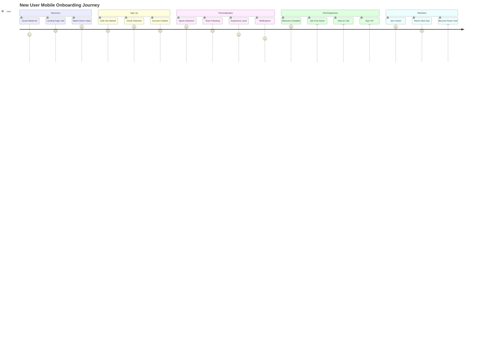
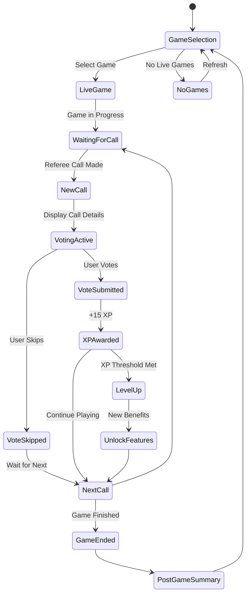
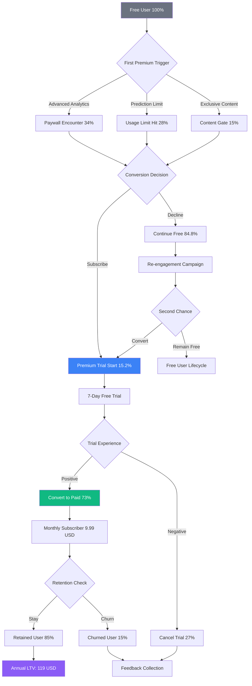
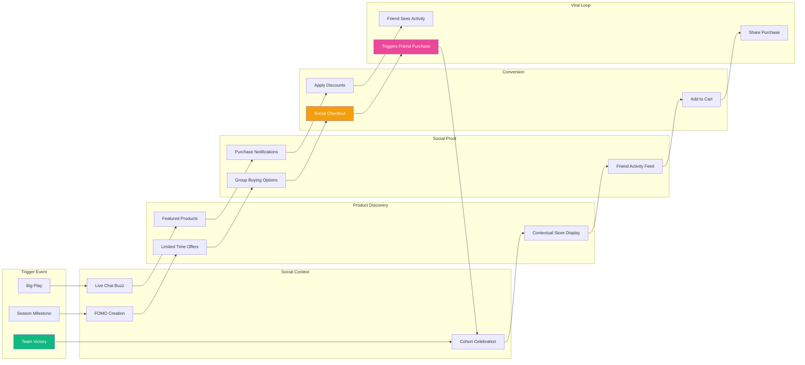
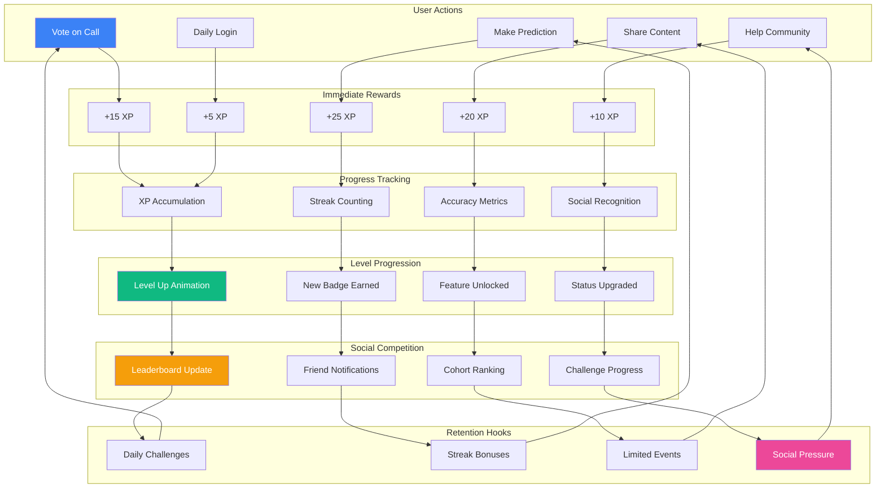
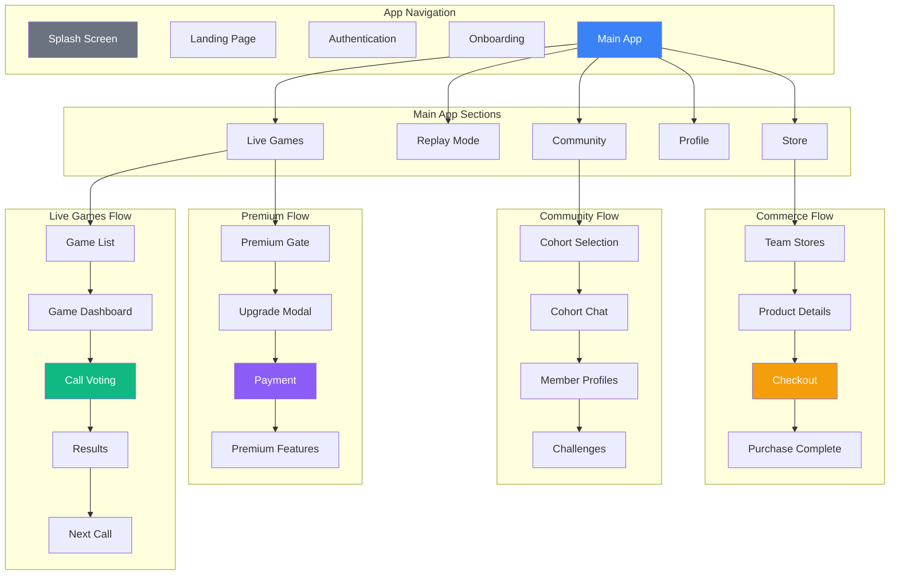
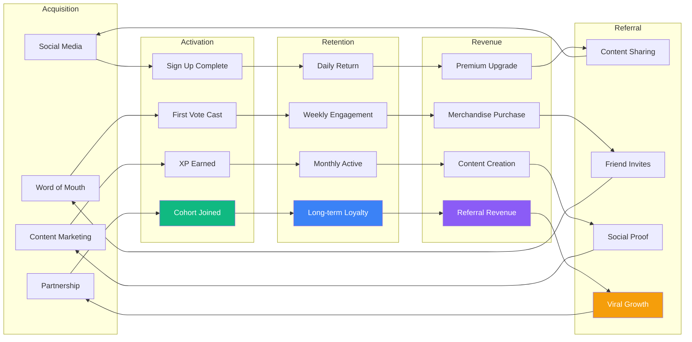

# Mobile UX Flows - Mermaid Wireframes

*Detailed Mobile User Experience Visualization*

## Mobile Onboarding Flow (375px)

## Live Game Interface State Diagram

## Revenue Conversion Funnel

## 🛒 Social Commerce User Flow

## 🎮 Gamification Engagement Loop

## Mobile Screen Flow Hierarchy

## User Engagement Metrics Flow

---

*These Mermaid mobile UX flows provide detailed visualization of user interactions, conversion funnels, and engagement patterns optimized for investor presentations and development planning.*
