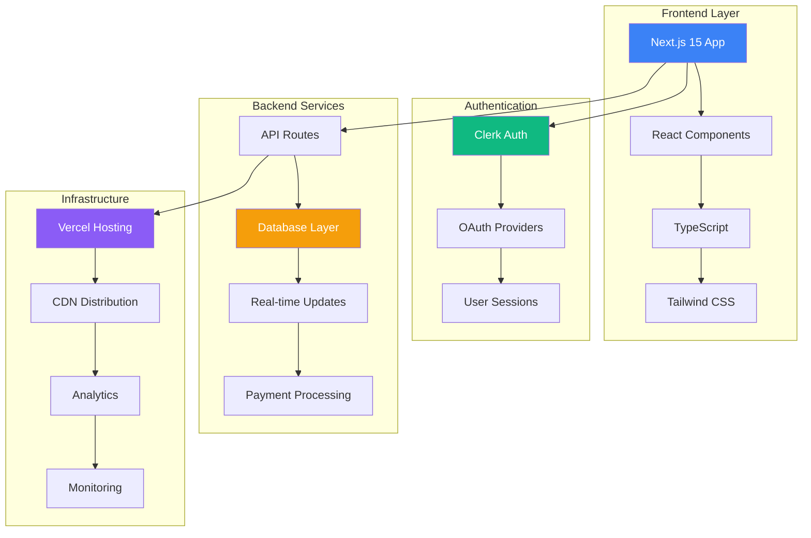
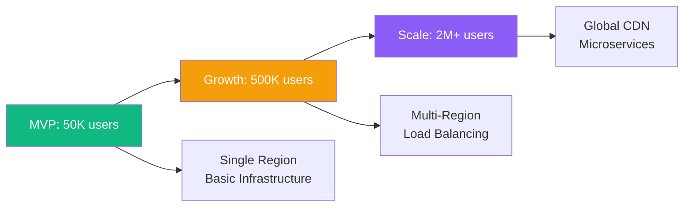

# 🔧 Technical Specifications

## Platform Architecture

## Technology Stack

### Frontend
- **Framework**: Next.js 15 with App Router
- **Language**: TypeScript for type safety
- **Styling**: Tailwind CSS for responsive design
- **UI Components**: Radix UI + custom components
- **State Management**: React hooks + context

### Backend
- **API**: Next.js API routes
- **Database**: PostgreSQL with Prisma ORM
- **Real-time**: WebSocket connections
- **Authentication**: Clerk for secure user management
- **Payments**: Stripe for premium subscriptions

### Infrastructure
- **Hosting**: Vercel for optimal Next.js performance
- **CDN**: Global edge distribution
- **Analytics**: Custom dashboard + Google Analytics
- **Monitoring**: Error tracking and performance metrics

## Performance Targets

- **Page Load**: < 2 seconds on 3G
- **Real-time Updates**: < 500ms latency
- **Mobile Performance**: 90+ Lighthouse score
- **Uptime**: 99.9% availability

## Security & Compliance

- **Data Protection**: COPPA compliant for youth users
- **Authentication**: Multi-factor authentication support
- **Privacy**: GDPR/CCPA compliant data handling
- **Content Moderation**: AI + human review system

## Scalability Plan

## Development Timeline

- **Phase 1 (Months 1-3)**: MVP with core features
- **Phase 2 (Months 4-6)**: Advanced features + mobile optimization
- **Phase 3 (Months 7-12)**: Scale infrastructure + AI features
- **Phase 4 (Year 2)**: Multi-sport expansion + enterprise features
